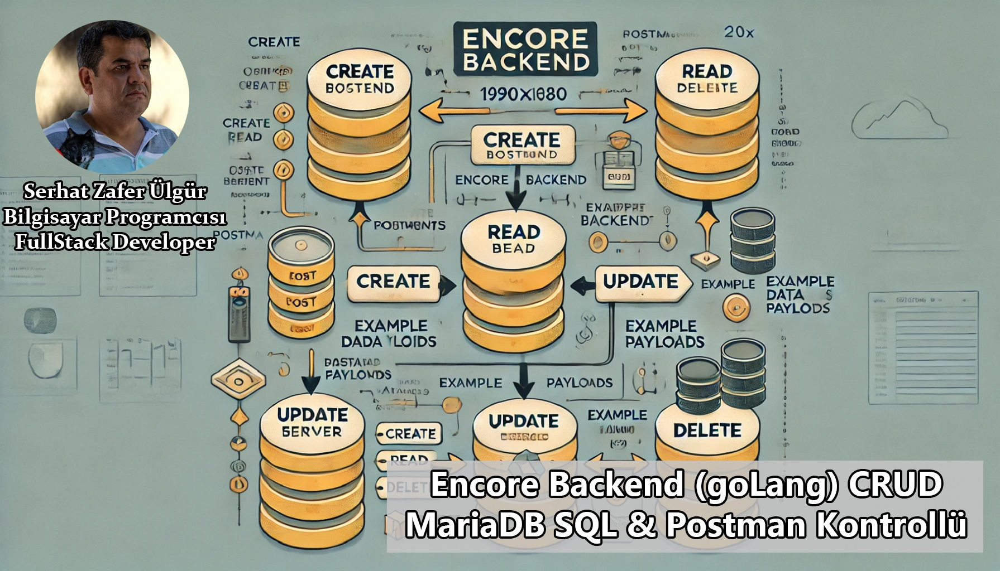

# 🎯 Encore Backend  

**Encore Backend** ile modern bir backend geliştirme deneyimine hazır olun! Bu proje, **GoLang** kullanılarak geliştirilmiş olup, **MariaDB** entegrasyonu ve **Postman** ile test edilebilir bir CRUD yapısını içermektedir. 🚀  

---

## 📸 Ekran Görüntüsü  
  

---

## 📺 YouTube Video  
Projenin detaylı anlatımını ve adım adım kurulum rehberini izlemek için aşağıdaki bağlantıya tıklayın:  
[](https://www.youtube.com/watch?v=kZKFPPpWBgY)  

---

## 🛠️ Teknolojiler ve Araçlar  
Bu projede kullanılan temel teknolojiler:  

- **GoLang**: Performanslı ve modern bir backend dili  
- **Encore Framework**: Go ile mikroservis geliştirme  
- **MariaDB**: Güçlü ve esnek bir veritabanı çözümü  
- **Postman**: API endpoint'lerini test etmek için  
- **GitHub**: Kaynak kod yönetimi ve paylaşım  

---

## 🧩 Özellikler  
- 🚀 **CRUD İşlemleri**: API üzerinden veri ekleme, okuma, güncelleme ve silme işlemleri  
- 🔗 **MariaDB Bağlantısı**: Gelişmiş veritabanı işlemleri  
- 📂 **RESTful API**: Postman ile kolayca test edilebilir yapı  

---

## 📦 Kurulum ve Çalıştırma  

### 1️⃣ Gereksinimler  
- [GoLang](https://golang.org/doc/install)  
- [MariaDB](https://mariadb.org/)  
- [Postman](https://www.postman.com/)  

### 2️⃣ Projeyi Klonlayın  
```bash
git clone https://github.com/kullaniciAdi/encore-backend.git
cd encore-backend

### 3️⃣ Bağımlılıkları Kurun
- go mod tidy
### 4️⃣ Veritabanını Yapılandırın
- MariaDB'de gerekli tabloları ve verileri oluşturmak için migrations.sql dosyasını kullanabilirsiniz.
### 5️⃣ Projeyi Çalıştırın
- encore run
